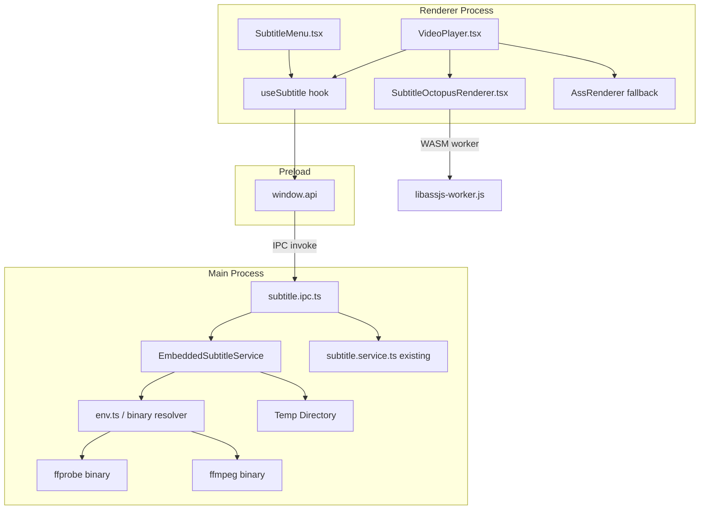

# Design Document: Embedded ASS Subtitle Support

## Overview

This design extends AniLocal's subtitle system in two orthogonal directions:

1. **Extraction pipeline** — The Electron main process gains an `EmbeddedSubtitleService` that invokes bundled `ffprobe` and `ffmpeg` binaries to detect and extract ASS subtitle tracks from MKV containers. New IPC channels (`subtitle:probeEmbeddedTracks`, `subtitle:extractEmbeddedTrack`) expose this capability to the renderer. Extracted files are cached in a per-session temp directory and deleted when the app closes.

2. **Renderer upgrade** — The canvas-based `AssRenderer.tsx` (currently backed by `ass-compiler`) is replaced by a SubtitleOctopus renderer using `@jellyfin/libass-wasm`, a WebAssembly build of `libass`. This delivers MPV-quality output including `\pos`, `\move`, `\fad`, `\kf`, `\t` transforms, karaoke, and embedded-font support. The fallback to `ass-compiler` is retained for environments where WebAssembly is unavailable.

The HTML5 `<video>` element remains the playback engine throughout; no native decoder integration is required.

---

## Architecture



### Key design decisions

**D1 — SubtitleOctopus library choice**: `@jellyfin/libass-wasm` (the Jellyfin-maintained fork of JavascriptSubtitlesOctopus) is the selected library. It is the most actively maintained WASM libass port with an npm package, ships a pre-built worker script and WASM binary, and has a well-documented `SubtitleOctopus` constructor API. It requires `workerUrl` and `legacyWorkerUrl` paths to the bundled worker scripts.

**D2 — WASM asset serving in electron-vite**: The `@jellyfin/libass-wasm` worker scripts and `.wasm` file cannot be bundled by Vite's normal module pipeline because the worker uses `importScripts` at runtime. They must be served as static assets. The strategy is to copy the package's `dist/` files into `resources/libass/` via electron-builder's `extraResources`, and at runtime resolve them to a `file://` URL using `app.getPath('exe')` / `process.resourcesPath`. In development, Vite's `assetsInclude` serves them from `node_modules`.

**D3 — ffmpeg/ffprobe path resolution**: `ffmpeg-static` and `ffprobe-static` npm packages are used. Each exposes a `.path` property pointing to the bundled binary. In packaged builds the binary lives inside `app.asar`, which cannot be executed, so `electron-builder`'s `asarUnpack` excludes them. The resolved path then has `app.asar` replaced with `app.asar.unpacked`. The existing `env.ts` pattern is extended with a `getBinaryPath` helper.

**D4 — Subtitle type extension**: The `Subtitle` type gains `source: 'embedded'` and an optional `trackIndex: number`. External/internal sources keep their existing shape. The `SubtitleRecord` type in `preload/index.ts` and `electron-api.ts` are updated to match.

**D5 — AssRenderer refactor**: `AssRenderer.tsx` becomes a thin wrapper that instantiates `SubtitleOctopusRenderer` when WASM is available, or the legacy canvas renderer when it is not. The public prop interface is unchanged so `VideoPlayer.tsx` requires minimal edits.

**D6 — Temp directory lifecycle**: The `EmbeddedSubtitleService` creates a subdirectory under `os.tmpdir()` at service initialisation (e.g. `os.tmpdir()/anilocal-subs-{timestamp}/`). The main process registers an `app.on('before-quit')` hook to delete it. A `Map<string, string>` cache (`videoPath:trackIndex → extractedPath`) prevents redundant extractions within a session.

---

## Components and Interfaces

### 1. `EmbeddedSubtitleService` (new — main process)

**File:** `src/main/services/embedded-subtitle.service.ts`

```typescript
export interface EmbeddedTrackDescriptor {
  index: number        // ffmpeg stream index (0-based)
  language: string     // ISO 639-2 tag, defaults to "und"
  codecName: string    // e.g. "ass", "subrip"
}

export interface EmbeddedSubtitleService {
  /** Returns detected ASS/SSA subtitle tracks in the given MKV file. */
  probeEmbeddedTracks(videoPath: string): Promise<EmbeddedTrackDescriptor[]>

  /** Extracts the specified track to a .ass file; returns absolute path. Caches results. */
  extractEmbeddedTrack(videoPath: string, trackIndex: number): Promise<string>

  /** Extracts font attachments from MKV; returns array of absolute font file paths. */
  extractFonts(videoPath: string): Promise<string[]>

  /** Deletes all files in the session temp directory. Called on app quit. */
  cleanup(): Promise<void>
}
```

The service is a singleton exported as `embeddedSubtitleService`. It uses Node's `child_process.spawn` (not `exec`) to run ffprobe/ffmpeg, with stdout/stderr collected via streams. JSON output is requested from ffprobe via `-print_format json -show_streams`.

### 2. `getBinaryPaths` helper (extends `env.ts`)

**File:** `src/main/config/env.ts` (extended)

```typescript
export function getBinaryPaths(): { ffmpegPath: string; ffprobePath: string }
```

Resolution logic:
- **Dev** (`!app.isPackaged`): reads `.path` directly from `require('ffmpeg-static')` and `require('ffprobe-static')`.
- **Packaged**: takes the same path and replaces `app.asar` with `app.asar.unpacked` to reach the unpacked binary. Falls back to `process.resourcesPath/ffmpeg[.exe]` if needed.

At startup the service calls `fs.access(path, fs.constants.X_OK)` on both binaries. If either check fails it logs a warning and sets an `extractionAvailable = false` flag; all subsequent calls return an error immediately without spawning processes.

### 3. `subtitle.ipc.ts` (extended)

**File:** `src/main/ipc/subtitle.ipc.ts`

New handlers added alongside existing ones:

```typescript
// subtitle:probeEmbeddedTracks
// Input:  { videoPath: string }
// Output: EmbeddedTrackDescriptor[]  |  { error: string }

// subtitle:extractEmbeddedTrack
// Input:  { videoPath: string, trackIndex: number }
// Output: { path: string }  |  { error: string }

// subtitle:extractFonts
// Input:  { videoPath: string }
// Output: { paths: string[] }  |  { error: string }
```

Error responses always include a human-readable `message` field. IPC errors do not throw; they return structured error objects so the renderer can handle them gracefully.

### 4. `SubtitleOctopusRenderer` (new — renderer)

**File:** `src/renderer/src/components/player/SubtitleOctopusRenderer.tsx`

```typescript
type SubtitleOctopusRendererProps = {
  assContent: string           // Raw .ass script text
  videoRef: React.RefObject<HTMLVideoElement | null>
  visible: boolean
  fonts?: string[]             // Optional: file:// URLs to extracted font attachments
}
```

Lifecycle:
1. On mount, detect WASM support via `typeof WebAssembly !== 'undefined'`. If absent, call `onFallback` prop.
2. Construct `SubtitleOctopus` with `{ video, subContent, workerUrl, legacyWorkerUrl, fonts }`.
   - `subContent` passes the raw ASS string directly (no subUrl needed).
   - `workerUrl`/`legacyWorkerUrl` are resolved at runtime via a helper that checks `import.meta.env.DEV` and returns the appropriate asset URL.
3. SubtitleOctopus internally drives its own `requestAnimationFrame` loop tied to `video.currentTime`.
4. When `visible` becomes `false`, call `instance.setIsPaused(true)` or dispose and re-create on re-enable.
5. On unmount, call `instance.dispose()` and cancel any pending RAFs.
6. On `assContent` change, dispose the old instance and construct a new one.
7. Listen to `ResizeObserver` on the video element; call `instance.resize()` on dimension change to keep overlay dimensions correct.

The component renders a `<div>` container that SubtitleOctopus populates (it manages its own canvas internally).

### 5. `AssRenderer.tsx` (refactored as router/wrapper)

**File:** `src/renderer/src/components/player/AssRenderer.tsx`

Becomes a decision component:

```typescript
type AssRendererProps = {
  assContent: string
  videoRef: React.RefObject<HTMLVideoElement | null>
  visible: boolean
  fonts?: string[]
}

export function AssRenderer(props: AssRendererProps) {
  const [wasmUnavailable, setWasmUnavailable] = useState(false)

  if (!wasmUnavailable) {
    return (
      <SubtitleOctopusRenderer
        {...props}
        onFallback={() => setWasmUnavailable(true)}
      />
    )
  }
  return <LegacyAssRenderer {...props} />
}
```

The existing canvas rendering code moves into `LegacyAssRenderer` (an internal component in the same file or a separate file). The public API of `AssRenderer` is unchanged so `VideoPlayer.tsx` needs only font-related additions.

### 6. `useSubtitle` hook (extended)

The hook gains awareness of `source: 'embedded'`. When the selected subtitle has `source === 'embedded'`:
1. Calls `window.api.extractEmbeddedTrack(videoPath, trackIndex)` to get the `.ass` file path.
2. Calls `window.api.extractFonts(videoPath)` to get font attachment paths.
3. Converts paths to `file://` URLs via `window.api.toFileUrl`.
4. Sets `assContent` from `window.api.readSubtitleFile(extractedPath)`.
5. Exposes a `fontUrls: string[]` value in the returned state.

`VideoPlayer.tsx` passes `fontUrls` down to `AssRenderer` as the `fonts` prop.

### 7. `SubtitleMenu.tsx` (extended)

Receives the full subtitle list (embedded + external). Embedded tracks are identified by `source === 'embedded'` and rendered with a distinct badge (e.g. `EMBEDDED` label in a different colour). The component sorts entries so embedded tracks appear before external tracks. The existing key-by-`path` approach is updated: embedded tracks use a synthetic path `embedded:{trackIndex}` as their unique key.

### 8. `anime.ts` — type extensions

```typescript
export type SubtitleSource = 'internal' | 'external' | 'embedded'

export type Subtitle = {
  label: string
  path: string              // For embedded: synthetic "embedded:{trackIndex}"
  extension: string         // '.ass' for embedded tracks
  language: string
  format: SubtitleFormat | string
  source: SubtitleSource
  trackIndex?: number       // Present when source === 'embedded'
}
```

### 9. Preload / `electron-api.ts` additions

New methods on `window.api`:

```typescript
probeEmbeddedTracks(videoPath: string): Promise<EmbeddedTrackDescriptor[] | { error: string }>
extractEmbeddedTrack(videoPath: string, trackIndex: number): Promise<{ path: string } | { error: string }>
extractFonts(videoPath: string): Promise<{ paths: string[] } | { error: string }>
```

`SubtitleRecord` in both `preload/index.d.ts` and `electron-api.ts` gains the optional `trackIndex?: number` field and `'embedded'` is added to the `source` union.

---

## Data Models

### EmbeddedTrackDescriptor

```typescript
interface EmbeddedTrackDescriptor {
  index: number      // Zero-based ffmpeg stream index for the subtitle stream
  language: string   // BCP-47 / ISO 639-2 tag; defaults to "und"
  codecName: string  // "ass" | "subrip" | etc.
}
```

### Extraction cache key

```
`${videoPath}:${trackIndex}`  →  extractedFilePath: string
```

Stored in an in-memory `Map<string, string>` on the `EmbeddedSubtitleService`. Not persisted to disk; cache is per session.

### Font cache key

```
videoPath  →  fontPaths: string[]
```

Stored in a separate `Map<string, string[]>` on the service. Fonts are extracted once per video file.

### Temp directory layout

```
os.tmpdir()/
  anilocal-subs-{sessionTimestamp}/
    {sanitizedVideoName}_{trackIndex}.ass    ← extracted subtitle
    {sanitizedVideoName}_fonts/
      {fontFilename}.ttf                     ← extracted font attachments
```

File names are sanitised (characters not in `[A-Za-z0-9_\-.]` replaced with `_`) to avoid path injection.

### Subtitle type (updated)

See Components and Interfaces section above. The `SubtitleRecord` in preload mirrors this shape for IPC transport.

---

## Correctness Properties

*A property is a characteristic or behavior that should hold true across all valid executions of a system — essentially, a formal statement about what the system should do. Properties serve as the bridge between human-readable specifications and machine-verifiable correctness guarantees.*

### Property 1: Non-MKV files skip probing and return empty track list

*For any* file path whose extension is not `.mkv`, `probeEmbeddedTracks` SHALL return an empty array without invoking the ffprobe spawner.

**Validates: Requirements 1.6**

### Property 2: Probe result completeness across arbitrary ffprobe output

*For any* ffprobe JSON response containing N subtitle streams (N ≥ 0), `probeEmbeddedTracks` SHALL return an array of exactly N track descriptors, where each descriptor has a non-negative `index`, a non-empty `language` string (defaulting to `"und"` when the tag is absent), and a non-empty `codecName` string. When N = 0, an empty array is returned without error.

**Validates: Requirements 1.2, 1.3, 1.5**

### Property 3: ffprobe / ffmpeg failure produces structured error with message

*For any* non-zero exit code returned by ffprobe or ffmpeg and any stderr content, the corresponding service method SHALL return an error object containing a non-empty `message` field and no track descriptor or file path data.

**Validates: Requirements 1.4, 2.5**

### Property 4: Extraction produces absolute .ass path and caches the result

*For any* video path and track index, a successful `extractEmbeddedTrack` call SHALL return an absolute file path ending in `.ass`, and a second call with the same arguments SHALL return the identical path without invoking ffmpeg a second time.

**Validates: Requirements 2.3, 2.4**

### Property 5: Embedded subtitle source routes to extraction IPC, not file read

*For any* `Subtitle` object with `source === 'embedded'`, the `useSubtitle` hook SHALL call `window.api.extractEmbeddedTrack` to obtain the file path and SHALL NOT call `window.api.readSubtitleFile` directly with the synthetic path field.

**Validates: Requirements 3.3**

### Property 6: Embedded tracks are always ordered before external tracks in the menu

*For any* mixed array of `Subtitle` objects containing at least one `source: 'embedded'` entry and at least one `source: 'external'` entry, the order of entries displayed by `SubtitleMenu` SHALL place every embedded track before every external track.

**Validates: Requirements 3.2**

### Property 7: At most one SubtitleOctopus instance exists at any point in time

*For any* sequence of distinct ASS content strings fed to `SubtitleOctopusRenderer`, at no point during the sequence SHALL more than one `SubtitleOctopus` instance be simultaneously active (i.e. each previous instance is disposed before the next is constructed).

**Validates: Requirements 5.5**

### Property 8: Visibility toggle round-trip preserves the active instance

*For any* `SubtitleOctopusRenderer` with a loaded ASS script, setting `visible` to `false` and then back to `true` SHALL not construct a new `SubtitleOctopus` instance — the same instance SHALL remain active throughout the round-trip and subtitles SHALL be rendered again after `visible` returns to `true`.

**Validates: Requirements 4.6**

### Property 9: Overlay container dimensions always match the video element after resize

*For any* new (width, height) dimensions reported by the `ResizeObserver` on the video element, the SubtitleOctopus overlay container dimensions SHALL equal the new video element dimensions after the resize callback is processed.

**Validates: Requirements 7.7, 6.4**

### Property 10: Binary unavailability produces structured error for all calls

*For any* call to `probeEmbeddedTracks` or `extractEmbeddedTrack` when `extractionAvailable` is `false` (set after binary validation fails at startup), the service SHALL return an object with a non-empty `message` field and SHALL NOT throw an unhandled exception or attempt to spawn a process.

**Validates: Requirements 9.4**

### Property 11: Non-existent file path yields structured error with message

*For any* file path that does not exist on the filesystem, both `probeEmbeddedTracks` and `extractEmbeddedTrack` SHALL return an error object with a non-empty `message` field without spawning a binary process.

**Validates: Requirements 8.3**

### Property 12: Video element properties are not modified by overlay operations

*For any* operation on the `SubtitleOctopusRenderer` (construction, content change, resize, visibility toggle, dispose), all observable properties of the passed `HTMLVideoElement` reference SHALL remain unchanged before and after the operation.

**Validates: Requirements 6.5**

---

## Error Handling

### Main process errors

| Scenario | Behaviour |
|---|---|
| ffprobe binary not found / not executable | Log warning at startup; set `extractionAvailable = false`; all IPC calls return `{ error: "ffprobe not available: ..." }` |
| ffmpeg binary not found / not executable | Same as above for ffmpeg |
| ffprobe exits non-zero | Return `{ error: "ffprobe failed: <stderr>" }` |
| ffmpeg exits non-zero during extraction | Delete partial output file; return `{ error: "ffmpeg failed: <stderr>" }` |
| Video path does not exist | Return `{ error: "File not found: <path>" }` without spawning binary |
| Temp directory creation failure | Return `{ error: "Failed to create temp directory: <reason>" }` |
| Session cleanup failure | Log warning; do not throw (app is already quitting) |

### Renderer process errors

| Scenario | Behaviour |
|---|---|
| WASM not supported | Log error; `AssRenderer` switches to `LegacyAssRenderer` |
| `probeEmbeddedTracks` returns error | Log warning; `useSubtitle` treats the file as having zero embedded tracks |
| `extractEmbeddedTrack` returns error | Show no subtitle (set `assContent = null`); log error |
| `SubtitleOctopus` constructor throws | Catch, log, fall back to legacy renderer |
| Worker URL resolution fails | Log error; fall back to legacy renderer |

All renderer-side errors are caught and logged via `console.error`; they do not surface to the user as UI alerts because subtitle failure is non-fatal to playback.

---

## Testing Strategy

### Dual testing approach

Unit tests cover specific examples, edge cases, and error conditions. Property-based tests verify universal invariants across generated inputs. Both categories together provide comprehensive coverage.

### Property-based testing

The feature's extraction logic and type transformations are suitable for PBT. The selected library is **fast-check** (TypeScript-native, well-maintained, no additional build configuration needed).

Each property test runs a minimum of 100 iterations. Tests are tagged with the originating design property:

```typescript
// Feature: embedded-ass-subtitle, Property 3: Probe result completeness
```

**Properties to implement as PBT:**

- **Property 1** (`non-mkv-skip`): Generate random file paths with non-mkv extensions. Assert `probeEmbeddedTracks` returns `[]` without calling the spawner.
- **Property 2** (`descriptor-completeness`): Generate arbitrary ffprobe JSON payloads with 0–64 subtitle streams, varying presence of language tags. Assert returned array length equals N, each descriptor has `index ≥ 0`, non-empty `language` (defaulting to `"und"`), non-empty `codecName`.
- **Property 3** (`error-structure`): Generate arbitrary non-zero exit codes and stderr strings for both ffprobe and ffmpeg failure cases. Assert returned objects have a non-empty `message` field.
- **Property 4** (`extraction-cache-idempotence`): Generate arbitrary `(videoPath, trackIndex)` pairs with mocked ffmpeg success. Call `extractEmbeddedTrack` twice. Assert spawner invoked once, both calls return a path ending in `.ass`.
- **Property 5** (`embedded-source-routes-to-ipc`): Generate `Subtitle` objects with `source='embedded'` and arbitrary trackIndex values. Assert `extractEmbeddedTrack` is called and `readSubtitleFile` is NOT called with the synthetic path.
- **Property 6** (`menu-ordering`): Generate arbitrary mixed lists of embedded + external `Subtitle` objects. Assert rendered order has all embedded entries before all external entries.
- **Property 7** (`single-instance-invariant`): Generate sequences of distinct ASS content strings. Assert at most one `SubtitleOctopus` instance is active between each transition.
- **Property 8** (`visibility-roundtrip`): Generate arbitrary `visible` toggle sequences. Assert `true → false → true` preserves instance identity.
- **Property 9** (`overlay-resize`): Generate random (width, height) pairs. Assert overlay container dimensions equal video element dimensions after resize callback.
- **Property 10** (`unavailable-binary-error`): Generate arbitrary arguments. With `extractionAvailable = false`, assert all calls return `{ error: string }` with non-empty message.
- **Property 11** (`nonexistent-path-error`): Generate arbitrary non-existent paths. Assert both handlers return `{ error: string }` without spawning a process.
- **Property 12** (`video-element-no-mutation`): Generate arbitrary overlay operation sequences. Assert all video element properties are identical before and after each operation.

### Unit tests (example-based)

- `EmbeddedSubtitleService.probeEmbeddedTracks` with a mock ffprobe JSON that includes 3 subtitle streams → returns 3 descriptors with correct fields.
- `EmbeddedSubtitleService.probeEmbeddedTracks` with a non-MKV path → returns `[]` synchronously.
- `EmbeddedSubtitleService.extractEmbeddedTrack` with a missing file → returns `{ error: "File not found..." }`.
- `getBinaryPaths` in dev mode → returns paths from `ffmpeg-static`/`ffprobe-static` packages.
- `getBinaryPaths` in packaged mode → `.path` contains `app.asar.unpacked`.
- `SubtitleMenu` with mixed embedded + external subtitles → embedded entries rendered first with `EMBEDDED` badge.
- `AssRenderer` with no WASM support → renders `LegacyAssRenderer` instead of `SubtitleOctopusRenderer`.
- `useSubtitle` with `source: 'embedded'` → calls `extractEmbeddedTrack` IPC, not `readSubtitleFile`.

### Integration tests

- Full extraction flow with real ffprobe/ffmpeg binaries against a sample MKV file (CI optional; can be gated behind `INTEGRATION_TEST=1`).
- Binary path resolution in packaged build via `electron-builder --dir` smoke test.

### Manual testing checklist

- Open an MKV with 2+ embedded ASS tracks; verify both appear in SubtitleMenu above any external tracks.
- Select an embedded track; verify subtitles render on-screen with correct styling.
- Seek to a position mid-event; verify subtitle appears immediately.
- Switch between embedded tracks; verify previous track is cleared, new track loads.
- Resize the window and enter fullscreen; verify subtitle positions scale correctly.
- Open a non-MKV file (MP4); verify no embedded track entries appear.
- Open an MKV with embedded fonts; verify styled fonts render.
- Simulate WASM unavailable (block `WebAssembly` global); verify fallback renderer activates.

### WASM asset configuration (build)

In `electron-builder.yml`, add:

```yaml
extraResources:
  - from: node_modules/@jellyfin/libass-wasm/dist/
    to: libass/
    filter:
      - '*.js'
      - '*.wasm'
asarUnpack:
  - resources/**
  - node_modules/ffmpeg-static/**
  - node_modules/ffprobe-static/**
```

In `electron.vite.config.ts` renderer section, add:

```typescript
assetsInclude: ['**/*.wasm'],
```

The worker URL resolver in `SubtitleOctopusRenderer.tsx`:

```typescript
function resolveWorkerUrl(filename: string): string {
  if (import.meta.env.DEV) {
    // Vite dev server serves node_modules assets via /@fs/
    return new URL(
      `../../../../../../node_modules/@jellyfin/libass-wasm/dist/${filename}`,
      import.meta.url
    ).href
  }
  // Packaged: files land at {resourcesPath}/libass/
  return `file://${process.resourcesPath}/libass/${filename}`
}
```

> Note: `process.resourcesPath` is not directly available in the renderer. It must be passed from the main process via an IPC call or a preload-injected constant at app startup, or alternatively stored as a Vite-injected environment variable via `define` in `electron.vite.config.ts`.
